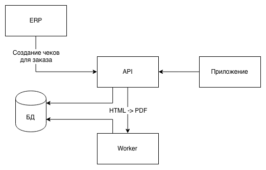

# Introduction

This project realized [that](https://github.com/smenateam/assignments/tree/master/backend) test assignment

Main Goal: to show, that I can implement basic service with asynchronous workers


## What does the service do



1. The service gets information about new order, creates checks for all printers in orders point in database, and starts asynchronous tasks to generate PDF-files for these checks. If there are no printers on point then error is returned. If checks for order have already been created, it returns an error.
2. Asynchronous worker with help of wkhtmltopdf generates PDF-file from HTML-template. Files are stored in project root media/pdf directory
3. Application requests service for new checks in following order: firstly, it requests list of checks that had already been generated for a given printer, secondly, it downloads PDF-files for every check.


## Project main stack

    - Django & Django Rest Framework
    - Celery
    - PostgreSQL
    - Redis


# How to run

1. Create and activate virtual environment, install requirements

```bash
python -m venv ./venv && source ./venv/bin/activate
pip install -r requirements.txt
```

2. Run infrastructure (PostgreSQL, Redis, Celery, wkhtmltopdf):

```bash
docker-compose up -d
```

3. Run Django test-server:

```bash
./manage.py runserver
```
